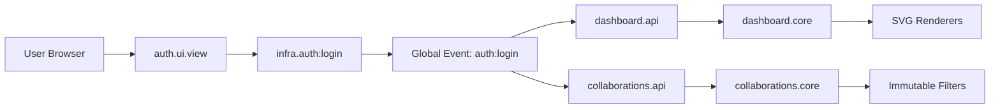

# GraphQL Profile

[]()
[](https://github.com/ertval/graphql/actions)

---

**Problem:** School progression stats and student collaborator metrics are scattered across multiple internal tools with no unified dashboard.

**Solution:** A single-pane view of XP analytics, audit ratios, and partner metrics by querying a GraphQL API—built in vanilla JS with zero external dependencies.

---

## 🚀 Features

- **JWT Authentication** — Secure login with Basic Auth; session-scoped token handling via `infra.auth` (memory + sessionStorage fallback).
- **Dynamic GraphQL Queries** — Normal, nested, and parameterised queries across `user`, `transaction`, `progress`, and `result` tables.
- **4 SVG Data Visualisations** — Animated charts built purely with native SVG elements:
  - **XP Analytics**: Cumulative XP line chart + XP by project bar chart.
  - **Audit & Results**: Audit ratio donut chart + Pass/Fail pie chart.
- **Collaborations Leaderboard** — Browse all school partners/captains/auditors with live search, role filters, and paginated results.
- **Collaborator Profile Overlay** — Click any collaborator to see their detailed stats and recent shared projects.
- **Project Detail** — Interactive project-level drill-down for deep inspection of results.
- **Theme Management** — Persistent Dark/Light mode support with system preference detection.
- **Glassmorphism UI** — Premium design with micro-animations, smooth transitions, and a responsive layout.

## 🛠️ Technology Stack

[](https://developer.mozilla.org/en-US/docs/Web/JavaScript)
[](https://graphql.org)
[](https://www.w3.org/Graphics/SVG/)
[](https://github.com/ertval/graphql/actions)

## 📂 Project Structure

```text
├── index.html              # SPA entry point
├── src/
│   ├── features/           # Domain-driven vertical slices (Screaming Architecture)
│   │   ├── auth/           # Authentication logic and login view
│   │   ├── collaborations/ # Collaborations leaderboard, filters, and profiles
│   │   ├── dashboard/      # Main stats, SVG charts, and activity
│   │   └── shell/          # Navigation, theme management, and app-wide UI layout
│   ├── infra/              # Technical adapters (Auth, GraphQL, UI helpers, Result pattern)
│   ├── shared/             # Shared UI components (popups)
│   └── app.js              # Event-driven application orchestrator
├── css/
│   ├── theme.css           # Design tokens (HSL palette, variables)
│   ├── base.css            # Layout, glassmorphism, and animations
│   ├── login.css           # Auth-specific styling
│   ├── nav.css             # Top navigation and tab styling
│   ├── dashboard.css       # Stats and activity layout
│   ├── graphs.css          # SVG chart specific styling
│   └── collaborations.css  # Tables and filters
├── tests/
│   ├── audit/              # Audit compliance and verification specs
│   ├── runtime/            # End-to-end integration flows
│   └── *.spec.mjs          # Unit and architectural boundary tests
└── docs/
    ├── audit.md            # Requirement checklist
    ├── audit_answers.md    # Detailed guide for audit verification
    ├── requirements.md     # Project functional specifications
    ├── audits/             # Security, architecture, and quality reports
    └── guides/             # Architecture, Security, and Learning materials
```

## 🚀 Getting Started

The app uses ES modules and fetches data from a remote API, so it must be served via a local HTTP server.

### Run locally
```bash
npx serve .
# or
python -m http.server 3000
```
Then open `http://localhost:3000` in your browser.

## 🧪 Testing

```bash
# Run all verification tests (lint + unit + audit + e2e)
npm test

# Run individual test suites
npm run test:unit
npm run test:audit
npm run test:e2e

# Run Biome linting/formatting
npm run lint
```

## 🔄 Data Flows



The application follows a **Decoupled Event-Driven Architecture**, ensuring feature slices communicate without tight coupling:

1. **Authentication Flow**:
   - `auth.ui.view` triggers `infra.auth:login()`.
   - On success, a global `auth:login` event is dispatched.
   - Slices (dashboard, collaborations) listen for `auth:login` to initialize their data.
   - `infra.graphql` handles token injection and automatic logout on 401/403 responses.

2. **Dashboard Pipeline**:
   - `dashboard.ui.view` reacts to `auth:login`.
   - Parallel fetching via `dashboard.api` retrieves all user metrics.
   - Pure logic in `dashboard.core` computes summaries (role counts, XP totals).
   - `dashboard.ui.view.renderers` updates the DOM using native SVG and modern CSS.
   - **Stale Guard**: A generation-based tracking system prevents race conditions during rapid reloads.

3. **Collaborations Pipeline**:
   - `collaborations.ui.view` handles lazy-loading stats on tab switch.
   - Filtering and sorting use **Immutable ES2026 methods** (`.toSorted()`).
   - Role and name normalization is handled by `collaborations.core`.

## 🛜 Deployment to GitHub Pages

Since the application is 100% static and relies on client-side JS and a remote API, it can be deployed very easily to GitHub Pages.

**Deploying directly from the repository**:
1. Commit and push all files to the `main` branch of your GitHub repository.
2. In your repository settings, go to **Pages** (under the "Code and automation" sidebar).
3. Under **Source**, leave it as "Deploy from a branch".
4. Under **Branch**, select `main` and the `/ (root)` folder, then click **Save**.
5. Ensure the `.nojekyll` file remains at the repository root to prevent GitHub Pages from ignoring files and folders that start with an underscore.
6. Your application will be live at `https://<your-username>.github.io/<repository-name>/`.

## 💡 Engineering Highlights

- **Zero Dependencies**: 100% vanilla JS/CSS/SVG.
- **Screaming Architecture**: Folder structure reflects the product domain.
- **Modern JavaScript**: Extensive use of `Temporal`, `Object.groupBy()`, `Promise.try()`, `Symbol.dispose` cleanup patterns, and `CustomEvents`.
- **Security First**: CSP + Trusted Types, no `localStorage` for JWT, and sanitised error handling.
- Clean Architecture: Domain logic is isolated from technical infrastructure and UI side-effects.

## Related
- [CV / Portfolio](https://ertval.github.io)
- [LinkedIn](https://linkedin.com/in/ertval)
