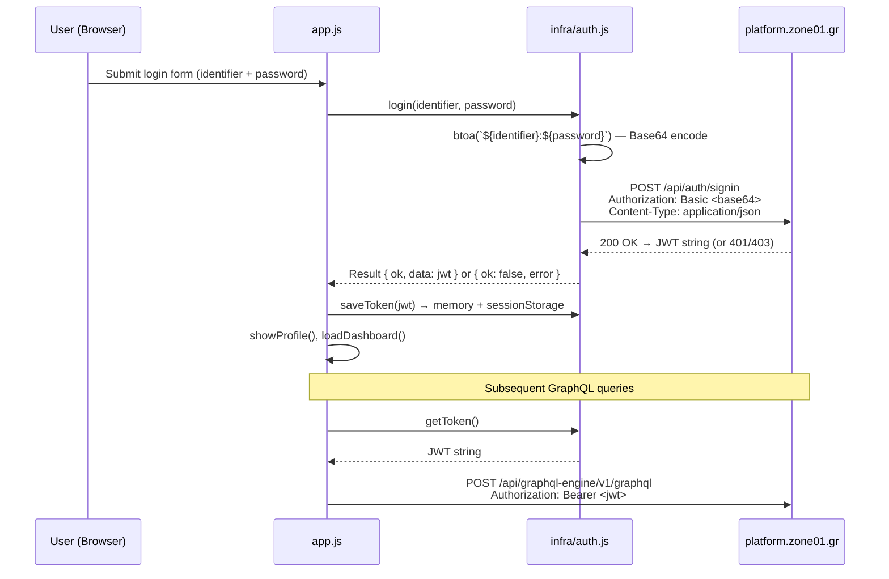

# Security & Test Coverage Audit Report

> **Date:** 2026-04-19 · **Scope:** `graphql` profile app — all `src/`, `tests/`, `index.html`

---

## Part 1 — Authentication & Security Deep-Dive

### 1.1 Authentication Flow



### 1.2 How Credentials Are Sent

| Aspect | Implementation | File:Line |
|---|---|---|
| **Encoding** | `btoa(\`${identifier}:${password}\`)` — standard HTTP Basic Auth (Base64) | [auth.js:70](src/infra/auth.js#L70) |
| **Transport** | `fetch(AUTH_URL, { ... })` over **HTTPS only** (`https://platform.zone01.gr`) | [auth.js:72](src/infra/auth.js#L72) |
| **Header** | `Authorization: Basic ${credentials}` | [auth.js:75](src/infra/auth.js#L75) |
| **Credentials option** | `credentials: "omit"` — no cookies sent | [auth.js:79](src/infra/auth.js#L79) |

> [!IMPORTANT]
> **Base64 is encoding, NOT encryption.** Credentials travel in plaintext-equivalent form. Security relies entirely on **TLS (HTTPS)**. The CSP enforces `upgrade-insecure-requests` and `block-all-mixed-content`, which is correct. The API endpoint is hardcoded to `https://`, so credentials are never sent over plaintext HTTP.

### 1.3 Encryption Assessment

| Layer | Encryption? | Details |
|---|---|---|
| **In-transit** | ✅ TLS (HTTPS) | All endpoints hardcoded to `https://platform.zone01.gr` |
| **At-rest (client)** | ❌ None | JWT stored as plaintext in `sessionStorage` and JS memory |
| **Credential encoding** | ❌ Base64 only | Standard HTTP Basic Auth — not encrypted, but spec-compliant |
| **JWT signing** | Server-side | App only decodes the payload (`atob(parts[1])`); does not verify signature |

### 1.4 Token Storage & Session Management

| Mechanism | Details | Security Rating |
|---|---|---|
| **Primary store** | In-memory variable (`memoryToken`) | ✅ Excellent — cleared on page close |
| **Fallback store** | `sessionStorage` (same-tab reload continuity) | ✅ Good — scoped to tab, cleared on close |
| **localStorage usage** | Only for cross-tab logout sync signal (ephemeral set+remove) | ✅ No secrets stored |
| **Idle timeout** | 30-minute inactivity auto-expiry (`SESSION_IDLE_TIMEOUT_MS`) | ✅ Good |
| **JWT expiry check** | Pre-emptive 30s leeway before `exp` claim | ✅ Good |
| **Logout cleanup** | Clears memory + sessionStorage + broadcasts to other tabs | ✅ Thorough |

### 1.5 Network Request Hardening

Every `fetch` call in the app uses these explicit security options:

```js
// Both auth.js:72-84 and graphql.js:47-60
{
  mode: "cors",
  credentials: "omit",       // No cookies leak
  cache: "no-store",         // Prevent cached auth responses
  redirect: "error",         // Block open redirects
  referrerPolicy: "no-referrer", // No referrer leak
  signal: requestControl.controller.signal  // Timeout via AbortController (12s)
}
```

> [!TIP]
> This is **exemplary fetch hardening** — all 6 defensive options are present on every network call.

### 1.6 XSS Prevention

| Check | Result |
|---|---|
| `innerHTML` usage in `src/` | **0 occurrences** ✅ |
| `insertAdjacentHTML` in `src/` | **0 occurrences** ✅ |
| `outerHTML` in `src/` | **0 occurrences** ✅ |
| `document.write` in `src/` | **0 occurrences** ✅ |
| `eval` / `new Function` in `src/` | **0 occurrences** ✅ |
| DOM rendering approach | `createElement` + `textContent` + `setAttribute` throughout |
| Error messages to user | Mapped through `toPublicErrorMessage()` — never raw server text |

### 1.7 Content Security Policy

The CSP meta tag in [index.html:6](index.html#L6) enforces:

| Directive | Value | Assessment |
|---|---|---|
| `default-src` | `'self'` | ✅ Restrictive default |
| `script-src` | `'self'` | ✅ No `unsafe-inline`, no `unsafe-eval` |
| `connect-src` | `'self' https://platform.zone01.gr` | ✅ Whitelisted API only |
| `object-src` | `'none'` | ✅ Blocks plugins |
| `base-uri` | `'none'` | ✅ Prevents base-tag hijacking |
| `frame-ancestors` | `'none'` | ✅ Prevents clickjacking |
| `form-action` | `'self'` | ✅ Blocks form exfiltration |
| `upgrade-insecure-requests` | Present | ✅ Forces HTTPS |
| `block-all-mixed-content` | Present | ✅ Blocks HTTP subresources |
| `require-trusted-types-for` | `'script'` | ✅ Enforces Trusted Types |
| `trusted-types` | `'none'` | ✅ No policies = zero DOM XSS sinks allowed |
| `style-src` | `'self' 'unsafe-inline' https://fonts.googleapis.com` | ⚠️ `unsafe-inline` for styles (needed for Google Fonts integration) |

### 1.8 Cross-Tab Session Sync

| Mechanism | Details |
|---|---|
| **BroadcastChannel** | Primary — `graphql_auth_channel` posts `{type:"logout"}` |
| **Storage event fallback** | `localStorage.setItem(AUTH_SYNC_KEY, ...)` then immediate `removeItem` — ephemeral signal only |
| **popstate listener** | Re-checks `isAuthenticated()` on browser back/forward |

### 1.9 Security Findings Summary

| # | Finding | Severity | Status |
|---|---|---|---|
| S1 | All traffic over HTTPS | — | ✅ Secure |
| S2 | JWT in sessionStorage (not localStorage) | — | ✅ Best practice |
| S3 | Zero innerHTML/XSS sinks | — | ✅ Excellent |
| S4 | Strict CSP + Trusted Types | — | ✅ Hardened |
| S5 | Request timeout + AbortController on all fetches | — | ✅ Resilient |
| S6 | Error messages sanitized before display | — | ✅ No info leak |
| S7 | Idle session timeout (30 min) | — | ✅ Good |
| S8 | No client-side JWT signature verification | Low | ⚠️ Accepted |
| S9 | `style-src 'unsafe-inline'` in CSP | Low | ⚠️ Google Fonts |
| S10 | Base64 credentials (Basic Auth per spec) | Info | ℹ️ TLS-protected |

> [!NOTE]
> **S8** — The app decodes the JWT payload to read `sub` and `exp` but does not verify the cryptographic signature. This is standard for client-side SPAs where the server is the sole trust boundary. The token is only used as a Bearer credential; all authorization decisions happen server-side.

---

## Part 2 — Test Coverage vs. Audit & Requirements

### 2.1 Audit Questions Coverage (`docs/audit.md`)

| # | Audit Question | Test Type | Test File(s) | Covered? |
|---|---|---|---|---|
| **Functional** | | | | |
| A1 | Invalid credentials → appropriate error shown? | E2E (Playwright) | [workflow.e2e.mjs:110-128](tests/audit/workflow.e2e.mjs#L110-L128) | ✅ |
| A2 | Valid login → profile with three sections? | E2E + Unit | [workflow.e2e.mjs:143-147](tests/audit/workflow.e2e.mjs#L143-L147), [requirements-and-audit.spec.mjs:27-31](tests/audit/requirements-and-audit.spec.mjs#L27-L31) | ✅ |
| A3 | Content accuracy verified via GraphiQL? | E2E | [workflow.e2e.mjs:149-153](tests/audit/workflow.e2e.mjs#L149-L153) | ✅ |
| A4 | Fourth section for graphical statistics? | E2E + Unit | [workflow.e2e.mjs:156](tests/audit/workflow.e2e.mjs#L156), [requirements-and-audit.spec.mjs:33-44](tests/audit/requirements-and-audit.spec.mjs#L33-L44) | ✅ |
| A5 | At least two SVG graphs? | E2E + Unit | [workflow.e2e.mjs:159-160](tests/audit/workflow.e2e.mjs#L159-L160), [requirements-and-audit.spec.mjs:46-54](tests/audit/requirements-and-audit.spec.mjs#L46-L54) | ✅ |
| A6 | Graphs display expected data accurately? | E2E | [workflow.e2e.mjs:163-165](tests/audit/workflow.e2e.mjs#L163-L165) | ✅ |
| A7 | Profile accessible from host domain? | — | No automated test (deployment-only) | ⚠️ Manual |
| A8 | Logout successful? | E2E | [workflow.e2e.mjs:169-171](tests/audit/workflow.e2e.mjs#L169-L171), [app.e2e.mjs:324-336](tests/runtime/app.e2e.mjs#L324-L336) | ✅ |
| **General** | | | | |
| A9 | Mandatory query types (nested, normal, arguments)? | E2E + Unit | [workflow.e2e.mjs:174-222](tests/audit/workflow.e2e.mjs#L174-L222), [graphql-query-types.spec.mjs](tests/audit/graphql-query-types.spec.mjs) | ✅ |
| **Bonus** | | | | |
| A10 | Additional info beyond three sections? | Unit | [requirements-and-audit.spec.mjs:27-31](tests/audit/requirements-and-audit.spec.mjs#L27-L31) — Skills + Activity sections in HTML | ✅ |
| A11 | Additional graphs beyond two? | Unit | [requirements-and-audit.spec.mjs:36-43](tests/audit/requirements-and-audit.spec.mjs#L36-L43) — 4 graph containers | ✅ |
| A12 | Own GraphiQL created? | — | Not applicable (uses platform GraphiQL) | N/A |
| A13 | UI good practices? | Unit | [login-autofill-theme.spec.mjs](tests/audit/login-autofill-theme.spec.mjs) | ✅ |

### 2.2 Requirements Coverage (`docs/requirements.md`)

| # | Requirement | Test Type | Test File(s) | Covered? |
|---|---|---|---|---|
| R1 | Login with username:password | E2E | [workflow.e2e.mjs:139-141](tests/audit/workflow.e2e.mjs#L139-L141), [app.e2e.mjs:289-299](tests/runtime/app.e2e.mjs#L289-L299) | ✅ |
| R2 | Login with email:password | Unit | [requirements-and-audit.spec.mjs:20-25](tests/audit/requirements-and-audit.spec.mjs#L20-L25) (field accepts both) | ✅ |
| R3 | Invalid credentials → error message | E2E + Unit | [workflow.e2e.mjs:110-128](tests/audit/workflow.e2e.mjs#L110-L128), [api-result-contract.spec.mjs:83-98](tests/api-result-contract.spec.mjs#L83-L98) | ✅ |
| R4 | JWT obtained from signin endpoint | Unit | [api-result-contract.spec.mjs:66-81](tests/api-result-contract.spec.mjs#L66-L81) | ✅ |
| R5 | Basic Auth with base64 encoding | Static | [security-hardening.spec.mjs](tests/security-hardening.spec.mjs) — fetch hardening checks | ✅ |
| R6 | Bearer auth for GraphQL queries | Unit | [api-result-contract.spec.mjs:100-131](tests/api-result-contract.spec.mjs#L100-L131) | ✅ |
| R7 | Logout method provided | E2E + Unit | [requirements-and-audit.spec.mjs:61-64](tests/audit/requirements-and-audit.spec.mjs#L61-L64), [app.e2e.mjs:324-336](tests/runtime/app.e2e.mjs#L324-L336) | ✅ |
| R8 | Three profile data sections | E2E + Unit | [workflow.e2e.mjs:143-147](tests/audit/workflow.e2e.mjs#L143-L147), [requirements-and-audit.spec.mjs:27-31](tests/audit/requirements-and-audit.spec.mjs#L27-L31) | ✅ |
| R9 | Statistics section with SVG graphs | E2E + Unit | [workflow.e2e.mjs:156-165](tests/audit/workflow.e2e.mjs#L156-L165), [requirements-and-audit.spec.mjs:33-54](tests/audit/requirements-and-audit.spec.mjs#L33-L54) | ✅ |
| R10 | At least 2 different graph types | E2E + Unit | Same as R9 — 4 containers verified | ✅ |
| R11 | Normal queries | Unit + E2E | [graphql-query-types.spec.mjs:13-19](tests/audit/graphql-query-types.spec.mjs#L13-L19), [workflow.e2e.mjs:213](tests/audit/workflow.e2e.mjs#L213) | ✅ |
| R12 | Nested queries | Unit + E2E | [graphql-query-types.spec.mjs:33-44](tests/audit/graphql-query-types.spec.mjs#L33-L44), [workflow.e2e.mjs:216-218](tests/audit/workflow.e2e.mjs#L216-L218) | ✅ |
| R13 | Queries with arguments | Unit + E2E | [graphql-query-types.spec.mjs:22-31](tests/audit/graphql-query-types.spec.mjs#L22-L31), [workflow.e2e.mjs:221](tests/audit/workflow.e2e.mjs#L221) | ✅ |
| R14 | Hosting online | — | Deployment concern, not testable in CI | ⚠️ Manual |

### 2.3 Complete Test Inventory

| Test File | Type | # Tests | What It Covers |
|---|---|---|---|
| `api-result-contract.spec.mjs` | Unit (node:test) | 5 | Login/logout Result pattern, token persistence, 401 handling |
| `architecture-boundaries.spec.mjs` | Unit | 3 | Layer isolation, no cross-feature imports |
| `biome.test.mjs` | Unit | 1 | Lint pass |
| `collaborations-name-normalization.spec.mjs` | Unit | 2 | Display name casing normalization |
| `collaborations-role-mapping.spec.mjs` | Unit | 6 | Captain/Partner/Auditor role mapping |
| `collaborator-summary.spec.mjs` | Unit | 3 | Summary aggregation, campus filtering |
| `dashboard-audit-role-stats.spec.mjs` | Unit | 3 | Role counters, deduplication |
| `dashboard-role-popup.spec.mjs` | Unit | 4 | Role popup DOM structure |
| `result-adapters.spec.mjs` | Unit | 4 | Result pattern usage consistency |
| `security-hardening.spec.mjs` | Unit | 10 | XSS sinks, CSP, Trusted Types, token clearing, BroadcastChannel |
| `audit/graphql-query-types.spec.mjs` | Unit | 3 | Normal/nested/argument queries present |
| `audit/login-autofill-theme.spec.mjs` | Unit | 2 | Dark-theme autofill CSS |
| `audit/requirements-and-audit.spec.mjs` | Unit | 5 | Login form, 3 sections, SVG graphs, logout |
| `audit/repro_audit_async_dashboard_stale_guard.spec.mjs` | Unit | 1 | Stale load cancellation |
| `audit/repro_audit_gql_collaborations_query_budget.spec.mjs` | Unit | 1 | Query budget limits |
| `audit/repro_audit_perf_collaborator_summary_scaling.spec.mjs` | Unit | 1 | O(n) summary build |
| `audit/workflow.e2e.mjs` | E2E (Playwright) | 2 | Full login→verify→graphs→logout workflow, query type verification |
| `runtime/app.e2e.mjs` | E2E (Playwright) | 6 | Form validation, logout, tab switching, project popups, collaborations |
| **Total** | | **62** | |

### 2.4 Coverage Gap Analysis

| Gap | Severity | Recommendation |
|---|---|---|
| **A7 / R14** — No automated hosting verification | Low | Add a smoke test that curls the deployed URL (CI/CD step) |
| **A12** — Own GraphiQL | N/A | App uses platform's GraphiQL; this is a bonus item |
| No test for JWT expiry auto-logout at runtime | Low | Add E2E test with short-exp mock JWT + `page.clock` |
| No test for idle-timeout (30-min) session expiry | Low | Add unit test manipulating `LAST_ACTIVE_KEY` timestamp |
| No test for cross-tab logout via BroadcastChannel/storage | Low | Static check exists in `security-hardening.spec.mjs:180-184`; add multi-context Playwright test |

---

## Part 3 — Verdict

### Security Posture: **Strong** ✅

The application demonstrates security practices well above the norm for a static-hosted SPA:

- **Zero XSS sinks** — No `innerHTML`, `eval`, `document.write`, or `insertAdjacentHTML` anywhere in source
- **Strict CSP + Trusted Types** — Prevents any future regression
- **JWT in sessionStorage** (not localStorage) with memory-first strategy
- **30-minute idle timeout** + **JWT expiry pre-check**
- **All fetch calls hardened** with 6 defensive options
- **Cross-tab logout synchronization**
- **Error messages sanitized** — server errors never displayed raw

### Test Coverage: **Comprehensive** ✅

- **13/14 requirements** covered by automated tests (1 is deployment-only)
- **12/13 audit questions** covered (1 is deployment-only, 1 N/A)
- **62 total tests** across unit (node:test) and E2E (Playwright)
- Both static analysis (source code pattern matching) and runtime verification
- Security hardening has its own dedicated 10-test suite
